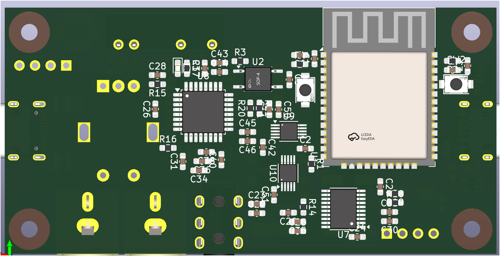

**Total time spent: 55h**

# July 17th

Well, another project isn't it?
This one started because I have this gorgeous Pioneer stereo, but if you want to feed it music from anything besides CDs and cassettes (which it eats them. I still gotta figure out why...), you're stuck with just RCA jacks.

Right now, I'm using your typical dollar store box that does bluetooth to headphone jack with an adapter to use RCA jacks. It's simple, but the sound quality is shitty at best with noise in the audio. You also have the added bonus of having a lady inside the box that says "The bluetooth device is connected successfully". gotta love that hard working lady.

So the is plan to make some kind of magic box that does the same thing but with actually good sound quality, with the ability to use a USB C as an AUX. Plus, it would need to have outputs, right? Both RCA jacks and a headphone jack for outputs.

I might even spice it up with a fm radio chip but I don't know if that's possible with my current knowledge of a potato.

Shall the research begin.

---

Alright from what I've gathered so far, I have a pretty good idea of what I want to do. I'll be using a esp32 wroom (I still have to choose the from the variants it has) because it has support for legacy bluetooth audio which neither the newer ones have support for, sadly.

For the audio part I'll be using obviously a external dac as the esp32's built in one is NOT up to the task, a audio codec and if I really wanted to spice it up with a fm radio chip I'd use a SI4703 as its the only one I found that was common enough with libraries and had semi-scarce stock inside lcsc.

I'll be using obviously two usb c ports. One for data and one for power.

The one used for data or better said the one that will be used as a AUX port will be using a usb isolator to eliminate the possible buzz noise added by who knows, because many of the goofy and crappy devices I've used somehow always had some kind of buzz noise even with a AUX cable. If you are going to do something, you gotta do it right I guess.

I might be even going to try the PCBA stuff from JLCPCB with this board if I can afford it. If not, shall manual soldering be.

**Total time spent: 4h**

# July 20th

hello world. After a bit of procastination I decided to scrap the whole fm radio part. Its just too complicated for me lol. I also have declared our magic box name as echowawa. wawa.

I've started to make the schematic for this box thingy. Finally I decided on a ESP32 WROOM 32E N8. The N8 means that it has 8 mb of flash memory. Its probably more than enough for my needs but who knows, maybe the firmware will eat a ton of space.

Ah. And the other parts like the usb isolator, DAC and the audio codec have been decided. These are, your typical avaliable usb 2.0 isolator in LCSC, a PCM5100 and another ic made by TI, the PCM2912A. For the DAC and output switching I'll be using an analog switch, the TS5A22364.

Btw, I like how TI has great datasheets for their chips (For what I've seen). In their datasheets they almost always have a section dedicated to the application and implementation of their chips. Which is pretty useful sometimes when you're implementing one of their chips.

What I DID not like is the docs of the USB isolator (ADUM3160) I've chosen from LCSC. I'm not sure if its because of the fact that it's a usb isolator or if it's because of the fact that it's a usb isolator. The only thing I love is the "X is don't care".

But really, its diagrams are not great.

**Total time spent: 5h**

# July 21st

I dislike the fact that every single thing has too many pins. That's equal to many tracks and possibly many vias to be able to route the top to the bottom and vice versa. And also is quite annoying to have to put what seems like a thousand capacitors for the audio related stuff (I will suffer for that when placing them down in the pcb).

I'm also starting to hate isolation because of the problems it's causing me right now. I might even remove it completely and just use directly the VBUS of that usb c (AUX) with the general GND of the board. But if I remove it am welcoming possible noise... so yeah.

**Total time spent: 2h**

---

opa. Shall the isolation not be axed.
The problem I had was caused by the fact that the USB C for AUX powers the audio codec, with both a VBUS isolator and USB isolator involved. This means the audio codec's outputs are using this isolated ground for everything. This isolated ground, as the name says, is totally cut off from the rest of the board except for the audio outputs themselves.

I was about to throw the whole isolation idea in the dumpster because of that. You might be thinking, "What happens when you connect your isolated ground to the board's ground? Or even anything that uses that ground to another different ground?". That the whole point of having a isolated ground is lost (and other things).

After placing and routing some stuff in the schematics (related to audio) I decided to research a how could I resolve this problem that I've caused my self. And who would have known that there's something called an audio transformer for this same purpose. what a great great day to waste time.

**Total time spent: 2h**

# July 22nd

I still don't like isolation even if I solved the problem I had. If there's any noise on the AUX signal I'll be very mad.

After reviewing the schematics to see if the thing I want to make is possible with the current stuff I have. I found out that somehow I miss read the datasheet of the audio codec. I though that the maximum output of the codec was 200mA. But it was 500mA. It doesn't make sense how could I have read that wrong. In the end I just had to scale up the power isolator to be able to output 600mA.
Remember, margins are always important!

**Total time spent: 1h**

---

While I was searching for every part in LCSC to avoid having to do it in the end, I found this weird headphone jack.

Or I think it's a headphone jack. Im not sure anymore.

I also discovered LCSC sells pin headers... and i just bought them from aliexpress with the project I've submitted before. god dammit.

And, I hate how I can only get yellow RCA jacks or just a double vertical jack that looks ugly as hell.

> The first image is the yellow jack that I HAVE to use and the second is the ugly jack that I've found.

I might even have to use some stickers to show where's the L and R sides >:(

**Total time spent: 1h**

---

I have to admit that I'm not a good at making pcbs. But god dammit what's wrong with me making a pcb that is crammed as hell and tiny as possible. It looks ugly as hell but I do not want to redo the whole thing.

Every single thing crammed in the top is the "power center" of the whole board and then the bottom is just the ICs that do the work but that ARE also crammed thanks to deadzone by the esp32 antena AND the pins that through the pcb. If I wanted to make it pretty I could but it needs to be routable or else its just a waste of time.

Even though this is the "first thought of organizing the pcb" and IS not wired up yet. I'm not really happy with it because it looks quite ugly.

But ohh... you don't want to see the schematic and I won't even add an image of it as its just the ugliest thing I've ever made. Everything is crammed into the center, sides and anywhere else. I still have to organize it.

Leaving that aside, I learned about optocouplers to be able to sense a 5v line from a 3v3 only gpio pin. This will be used to sense when the USB C that will be used as an AUX is plugged in or not via its vbus.

But why not just use a simple voltage divider? Its because of the fact that there's two different grounds!!! Again, you would defeat the whole purpose of isolating the aux's ground. You could imagine a optocoupler as a tiny light sensor with its own light inside that is connected to the VBUS. When VBUS is present, the "light" is on, and when it's not, the "light" is off and we sense that!

Before ending the log for this day, I have to say that I hate going back and back to get each part 3d model from LCSC. it tedious as hell.

**Total time spent: 2h**

# July 22nd

I don't like where this is going. I've never soldered SMD components (I will do soon) so I was choosing always the size that seemed the perfect for someone like me the 805 size. Well guess what? I'll have to make it smaller for this hecking project or else things won't fit in the tiny board size am craving for. I swapped all caps and resistors footprints to using the 603 size ones. gotta love making my self a lot of challenges.

Just as before, I just have where I might be putting the caps and components in the backside. This actually took A LOT longer than I expected. And I expect to be wrong as hell when I'll be trying to wire them.

I also added a rotary encoder with a button for navigation (you can only see the bottom lol).

**Total time spent: 3h**

# July 24th

I don't like how everything is crammed as hell. The principle I've been following since making my first 4 layer pcbs is to ALWAYS exhaust the options in the top AND bottom layer before skipping to the inner layers. Thanks to that I have just ENOUGH space to place a hecking via or wire stuff. There's always the possibility that am doing this pretty pretty wrong and I might have to redo the entire thing in the future.

I also love making a schematic with everything neatly plugged into the ESP32's io in order, only to end up having to unorganize it all just so I can actually route the board. great stuff. tsk.

Leaving that aside (again), look at the PCB!! Here's how it looks from the top and the bottom!

And here's the pcb with rounded corners:

You decide what side is more crammed (unintentionally).

OOHHH, and by the way! The organization I've made before with the caps and other things in the top was thrown into the trash as it wasn't actually functionally working in the position all of those things were lol.

**Total time spent: 5h**

# July 25th

Well. In my past project when I reached this point I decided to make the firmware and then the case. This time I decided to make the case first and then the firmware.

So, today is the day to export the pcb as a step file so I can make the beautiful compact case. It will be possibly a boring one haha.

When I finish the case for this thing I'll have to go back to the pcb and fix the whole silkscreen related warnings thanks to the tiny smd components REFs going through one another. If I can't fit their REF I will just delete their silkscreen lol.

I mean, I can rely purely on the beautiful "Interactive BOM" plugin I found out in my past project. As it shows me what components are where and what should be put where.

---

woowie, in reality I didn't start making the case. Instead I just beautified the schematic of all the things and divided them into pages. Its miles better than before and would have been useful if I had it before.

Here's one of the pages.

The only thing that I did not do because of pure laziness is to put the title, date, rev, my name. Now its time to make the case.

**Total time spent: 30min**

---

Big oopsy from my tiny part. I forgot the EC11 3d model lol. You can actually see that its missing in the screenshot (July 24th) haha

---

Ahahaha... I placed the encoder at the left side instead of the right side. And for some reason while looking at the 3d preview from kicad I was just thinking "yup, this in the right side and not the left". I'll live with lol.

Thanks fusion360.

look at the beginnings of making a case. beautiful. shall I just jump to the finished case now that you seen the beginnings.

**Total time spent: 2h**

---

Again thanks mr fusion for letting me know that the screen I wanted might be a little too small. I will be swapping it from the 0.96 inch OLED to a 1.3 inch OLED. Same resolution and i2c interface but bigger. Practically the whole justification for this is that I feel that the screen will be too small in real life.

> The first image is the OLED I had before I swapped it to the 1.3 inch one.

Sadly, I had to redo the whole case after doing that. Purely because I did stuff out of order leaving for the end the actual mounting holes for the case and... case. And also because the oled was colliding with the mounting holes. no good.

I mean, not that the case was done or anything but god dammit I've already spent time putting the decoration and stuff to it.

**Total time spent: 3h**

---

sadly I had to redo the whole pcb. The main reason was the pure ugliness of the organization on the components AND that the audio jacks were in the wrong side lol. Like the usbc for power is supposed to be on the left side and the audio outputs on the back. Instead I had the audio outputs on the front which isn't really the right way to do it as you might have noticed.

BUT god DAMN, it looks better in everyway!!

And am not kidding, IT is better than before. The things are actually organized and not put in strange ways as before. The only thing left is, again, the silkscreen stuff and warnings but that will be done with the final preparations haha.

I have also routed it already if you haven't noticed the ground plane with all the wonky tracks.

This is the reason why YOU should sometimes redo stuff even if it eats a lot of time.

**Total time spent: 6h**

# July 26th

this is the day the case will be done. shall the case be done by the next log.

---

magic. its done. I like how it ended up because the screen caused some pretty apparent space problems (thanks to the RCA jacks yellow plastic thingy) BUT its been resolved and ended up like this pretty beauty.

Just as before, I was considering making stickers for the ports to know where to connect stuff because of the two equally same usb c ports. But sadly I don't have a sticker printer nor access to one. You'll have to guess what is and what isn't the power port via the position of knob or screen lol.

Also, you might have noticed that the knob is pretty similar to the one of my last project, because it is the same knob but with a rounded arrow on the top. If it works, don't fix it.

**Total time spent: 4h**

---

Alright, now I need to make the firmware for this or else its a pure plastic brick with electronics. Just as my last project i'll be using platform io and some libraries to enable the receiving of bluetooth audio and the use of the rotary encoder.

I also have found out about a webpage named wokwi. Its a simulator. Its pretty nice to be able to have something like that when you don't have the real hardware. Even if it runs at half the speed you can prototype your stuff in there. Quite nice.

---

The firmware is practically done. It has the Minimum Viable Product (MVP) characteristics in it.

Bluetooth and AUX manual swapping with included automatic swapping to AUX if it has connected. You can also swap the outputs. The switching is handled by two analog switches.

The thing that took the most time was the design for the lil' BIG oled screen and the actual menu handling (its more about the menu handling). At least I think the design looks good, here's some screenshots of it:

> The first image is the main menu. The second one is the unimplemented dialog.

When you try to access the settings menu you'll just get that unimplemented dialog. :) MVP MVP MVP

Also, before I forget to mention, platform io does not have listed bare esp32-wroom-32e as a board. My workaround was to use the esp32dev board with custom build partitions (its from this [github repo](https://github.com/espressif/arduino-esp32/blob/master/tools/partitions/default_8MB.csv)) and flash size.

I have to remark that prototyping with wokwi is slow as hell. that's it. otherwise its a great great tool.

**Total time spent: 7h**

# July 27th

Its time for preparations for sending my project for review!!!!!!!

These tasks include:

- Finishing the schematics.
- Reviewing the pcb.
- Giving the pcb a new look with the silkscreen.
- Re-review the firmware.
- Making a render of the case.
- Finally, making the BOM.csv and BOM.tsv files.

---

The schematics have been finished with updated LCSC part numbers because of the change to 603 sizes on the caps and resistors, added the information in the corner and organized some of the parts that felt out of place in the Power page of the schematics. Look at my info corner! its the typical info you can input in kicad.

The pcb has gotten a new look with the silkscreen giving it special magical properties and has been re-reviewed to fix some wonky issues with the traces and unoptimized component placement (practically components that were using more space than they needed). shall i present you my creation:

> The front of the pcb is only shown because its the most crammed.

About the firmware, before it had methods put in any place of the code. It has now been reworked and cleaned up a bit to be more readable. Now you can know what the hell is going on in the code without the need for comments (It doesn't right now comments for now. It will be added later) or even scrolling up and down repeatedly to search for a specific thing.

To the case I did some retouches in the insides and added the oled screen design into the actual screen in the design. Just as a quick tutorial, you just need to go to the appearances tab, search for OLED and add it to the screen then modify the image it comes (windows 7 2014. memories) with the image you want. It took me a while to figure out how to do that (I didn't even know that fusion had a oled screen appearance in the library in the first place).

> This the final render of the case. Quite nice right?

And the final touch, the BOM file has been made and this thing isn't as costly as I thought it would be. And btw, the PCBA is too costly for me, so I'll have to build it myself.

**Total time spent: 7h**

# July 28th

I almost forgot to make the readme file!

Shall the submission be done. Hoping for the best haha.

**Total time spent: 30min**
