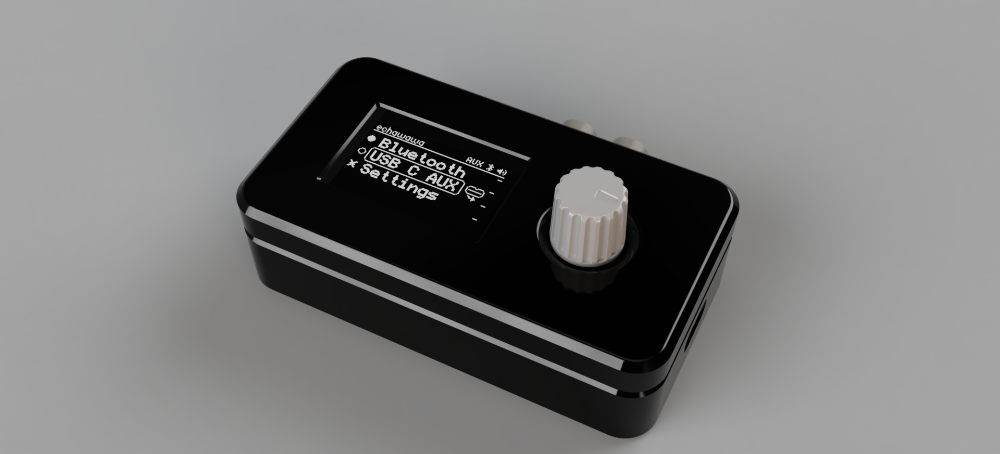

# echowawa

> [!NOTE]
> This project is still in progress and not even close to being finished. Not even built yet.

Your typical DAC with bluetooth audio (with possible upgrades to use WiFi sources) and a USB C as an AUX port. It can output to either RCA jacks or a headphone jack. It also features a pretty fancy oled screen with its cool menu navigated via the knob.

The reason I made this was because of the fact that I am no longer a fan of using cheap bluetooth magic boxes with bad audio output when I can make my own magic box with probably better audio quality and a better design.

## Images

> The echowawa pcb

> The echowawa case

> The echowawa root schematic

> The echowawa power schematic

> The echowawa audio schematic

## BOM

> NOTE: This is a copy of the BOM.csv file. The shipping cost might be actually higher than the price listed here.

| Item | Quantity | LCSC Part Number | Cost EUR | Cost USD | Link |
|---|---|---|---|---|---|
| 1uF Capacitor | 26 | C29936 | 0,25 € | $0,28 | <https://lcsc.com/product-detail/Multilayer-Ceramic-Capacitors-MLCC-SMD-SMT_Samsung-Electro-Mechanics-CL10B105KA8NNNC_C29936.html> |
| 100nF Capacitor | 5 | C14663 | 0,22 € | $0,25 | <https://lcsc.com/product-detail/Multilayer-Ceramic-Capacitors-MLCC-SMD-SMT_YAGEO-CC0603KRX7R9BB104_C14663.html> |
| 10uF Electrolytic Capacitor | 4 | C22387953 | 0,21 € | $0,24 | <https://lcsc.com/product-detail/Aluminum-Electrolytic-Capacitors-SMD_FOLLON-EFVH025ADA100M0454_C22387953.html> |
| 2.2nF Capacitor | 4 | C107082 | 0,23 € | $0,26 | <https://lcsc.com/product-detail/Multilayer-Ceramic-Capacitors-MLCC-SMD-SMT_YAGEO-CC0603KRX7R9BB222_C107082.html> |
| 4.7uF Capacitor | 2 | C389010 | 0,30 € | $0,35 | <https://lcsc.com/product-detail/Multilayer-Ceramic-Capacitors-MLCC-SMD-SMT_muRata-GRM188Z71C475KE21D_C389010.html> |
| 27pF Capacitor | 2 | C376778 | 0,23 € | $0,26 | <https://lcsc.com/product-detail/Multilayer-Ceramic-Capacitors-MLCC-SMD-SMT_CCTC-TCC0603COG270J500CT_C376778.html> |
| 2.2uF Capacitor | 2 | C914769 | 0,43 € | $0,49 | <https://lcsc.com/product-detail/Multilayer-Ceramic-Capacitors-MLCC-SMD-SMT_YAGEO-CC0603KRX7R7BB225_C914769.html> |
| 100pF Capacitor | 2 | C14858 | 0,29 € | $0,33 | <https://lcsc.com/product-detail/Multilayer-Ceramic-Capacitors-MLCC-SMD-SMT_Samsung-Electro-Mechanics-CL10C101JB8NNNC_C14858.html> |
| 100uF Electrolytic Capacitor | 2 | C99837 | 0,28 € | $0,32 | <https://lcsc.com/product-detail/Aluminum-Electrolytic-Capacitors-SMD_ROQANG-RVE1V101M0607_C99837.html> |
| 3.3uF Capacitor | 1 | C5360803 | 0,55 € | $0,63 | <https://lcsc.com/product-detail/Multilayer-Ceramic-Capacitors-MLCC-SMD-SMT_CCTC-TCC0603X5R335M250CT_C5360803.html> |
| 5.1K Resistor | 4 | C105580 | 0,11 € | $0,12 | <https://lcsc.com/product-detail/Chip-Resistor-Surface-Mount_YAGEO-RC0603FR-075K1L_C105580.html> |
| 24K Resistor | 4 | C23352 | 0,10 € | $0,11 | <https://lcsc.com/product-detail/Chip-Resistor-Surface-Mount_UNI-ROYAL-0603WAF2402T5E_C23352.html> |
| 3.3K Resistor | 4 | C108078 | 0,11 € | $0,12 | <https://lcsc.com/product-detail/Chip-Resistor-Surface-Mount_YAGEO-RC0603FR-073K3L_C108078.html> |
| 4.7K Resistor | 3 | C99782 | 0,10 € | $0,11 | <https://lcsc.com/product-detail/Chip-Resistor-Surface-Mount_YAGEO-RC0603FR-074K7L_C99782.html> |
| 470 Resistor | 3 | C114669 | 0,11 € | $0,12 | <https://lcsc.com/product-detail/Chip-Resistor-Surface-Mount_YAGEO-RC0603FR-07470RL_C114669.html> |
| 0 Resistor | 1 | C95177  | 0,10 € | $0,11 | <https://lcsc.com/product-detail/Chip-Resistor-Surface-Mount_YAGEO-RC0603JR-070RL_C95177.html> |
| 10K Resistor | 1 | C98220 | 0,10 € | $0,11 | <https://lcsc.com/product-detail/Chip-Resistor-Surface-Mount_YAGEO-RC0603FR-0710KL_C98220.html> |
| 1.5K Resistor | 1 | C114668 | 0,11 € | $0,12 | <https://lcsc.com/product-detail/Chip-Resistor-Surface-Mount_YAGEO-RC0603FR-071K5L_C114668.html> |
| 1M Resistor | 1 | C105578 | 0,11 € | $0,12 | <https://lcsc.com/product-detail/Chip-Resistor-Surface-Mount_YAGEO-RC0603FR-071ML_C105578.html> |
| 100 Resistor | 1 | C105588 | 0,09 € | $0,10 | <https://lcsc.com/product-detail/Chip-Resistor-Surface-Mount_YAGEO-RC0603FR-07100RL_C105588.html> |
| 6.8uH Power Inductor | 1 | C135295 | 0,41 € | $0,47 | <https://lcsc.com/product-detail/Power-Inductors_SXN-Shun-Xiang-Nuo-Elec-SMNR6020-6R8MT_C135295.html> |
| Neopixel | 2 | C965555 | 0,36 € | $0,41 | <https://lcsc.com/product-detail/RGB-LEDs-Built-in-IC_Worldsemi-WS2812B-2020_C965555.html> |
| LED (Green) | 1 | C965804 | 0,39 € | $0,44 | <https://lcsc.com/product-detail/LED-Indication-Discrete_XINGLIGHT-XL-1608UGC-04_C965804.html> |
| XC6220B331MR | 2 | C86534 | 0,78 € | $0,89 | <https://lcsc.com/product-detail/Voltage-Regulators-Linear-Low-Drop-Out-LDO-Regulators_TOREX-XC6220B331MR-G_C86534.html> |
| TS5A22364DGSR | 2 | C105181 | 1,22 € | $1,40 | <https://lcsc.com/product-detail/Analog-Switches-Multiplexers_TI-TS5A22364DGSR_C105181.html> |
| ESP32-WROOM-32E-N8 | 1 | C701342 | 4,05 € | $4,65 | <https://lcsc.com/product-detail/WiFi-Modules_ESPRESSIF-ESP32-WROOM-32E-N8_C701342.html> |
| TLP185xSE | 1 | C7240 | 0,44 € | $0,51 | <https://lcsc.com/product-detail/Transistor-Photovoltaic-Output-Optoisolators_TOSHIBA-TLP185-GB-TPL-SE-T_C7240.html> |
| ADUM3160 | 1 | C284149 | 4,22 € | $4,85 | <https://lcsc.com/product-detail/Isolated-USB-ICs_ADI-ADUM3160BRWZ-RL_C284149.html> |
| F0505S-3WR2  | 1 | C5369564 | 1,93 € | $2,22 | <https://lcsc.com/product-detail/Isolated-Power-Modules_YLPTEC-F0505S-3WR2_C5369564.html> |
| PCM5100APWR | 1 | C131154 | 0,74 € | $0,85 | <https://lcsc.com/product-detail/ADCs-DACs-Special-Purpose_TI-PCM5100APWR_C131154.html> |
| PCM2912APJTR | 1 | C475497 | 3,80 € | $4,36 | <https://lcsc.com/product-detail/Audio-Interface-ICs_TI-PCM2912APJTR_C475497.html> |
| 6MHz Crystal | 1 | C7528811 | 0,39 € | $0,45 | <https://lcsc.com/product-detail/Crystals_YXC-Crystal-Oscillators-H6OEL89CSC-SUGYLC-6M_C7528811.html> |
| EC11E18244AU | 1 | C202365 | 1,71 € | $1,96 | <https://lcsc.com/product-detail/Rotary-Encoders_ALPSALPINE-EC11E18244AU_C202365.html> |
| Round TINY SMD Button | 2 | C720477 | 0,36 € | $0,41 | <https://lcsc.com/product-detail/Tactile-Switches_XUNPU-TS-1088-AR02016_C720477.html> |
| Audio Transformer | 2 | C596483 | 1,56 € | $1,79 | <https://lcsc.com/product-detail/Audio-Transformers_Sumida-ESMIT-4180-C_C596483.html> |
| RCA Jack | 2 | C18080 | 0,48 € | $0,55 | <https://lcsc.com/product-detail/RCA-Connector_BOOMELE-Boom-Precision-Elec-AV-5_C18080.html> |
| USBC Power Only | 1 | C668623 | 0,31 € | $0,35 | <https://lcsc.com/product-detail/USB-Connectors_SHOU-HAN-TYPE-C-6P-073_C668623.html> |
| USBC USB2.0 | 1 | C2988369 | 0,35 € | $0,40 | <https://lcsc.com/product-detail/USB-Connectors_G-Switch-GT-USB-7010ASV_C2988369.html> |
| Headphone Jack | 1 | C381131 | 0,46 € | $0,53 | <https://lcsc.com/product-detail/Audio-Connectors_XKB-Connection-PJ-3136-B_C381131.html> |
| 1.3 Inch OLED 128x64 | 1 | ----- | 2,80 € | $3,29 | <https://es.aliexpress.com/item/1005007451015054.html> |
| JLCPCB Echowawa 4 Layer PCB | 5 | ----- | 5,95 € | $7,00 | ----- |
| M2.5 Heat Inserts OD4mm Length 6mm  | 4 | ----- | 2,38 € | $2,79 | <https://es.aliexpress.com/item/1005003582355741.html> |
| M2.5 Allen Bolts 20mm Stainless Steel | 4 | ----- | 2,41 € | $2,83 | <https://es.aliexpress.com/item/32810872544.html> |
| USB to Serial Adapter | 1 |  | 1,41 € | $1,66 | <https://es.aliexpress.com/item/1005006445462581.html> |
| ~Shipping | ----- | ----- | 15 € | $17,61 | ----- |
| TOTAL | ----- | ----- | 57,94 € | $67,22 | ----- |
